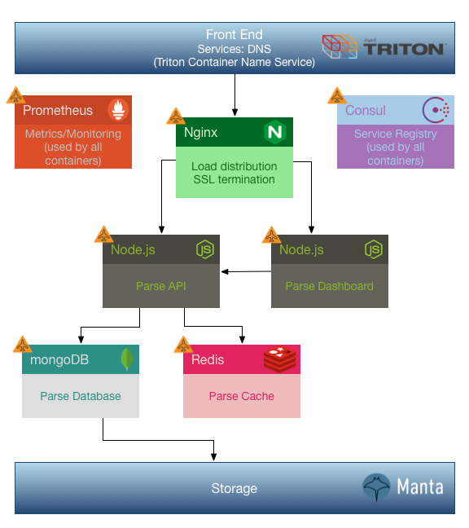

# Parse on AutoPilot

Implementation of [Parse](http://parse.com/) using the [AutoPilot pattern](https://www.joyent.com/blog/app-centric-micro-orchestration).

This solution features an Nginx reverse proxy front-end that will redirect to both Parse API Server and Parse Dashboard instances running in their own containers.  Parse API Server instances connect to a mongoDB replica set and to a Redis cache.  The service directory that manages all of this is Consul.  All services make telemetry available to Prometheus.  All of the support services also run in their own containers.  Any and all of these containers can be scaled and all other containers will adjust automatically thanks to [ContainerPilot](https://www.joyent.com/containerpilot).

You can run this in any Docker environment, but there is a custom composition for deployment on Joyent Triton that uses Triton Container Name Service (CNS) for load balancing Nginx and Triton Manta for mongoDB persistence (TBD).  When running on Triton, the architecture looks like this:

## Deploying Locally

A Docker environment is required to build/run this solution.

To build the containers:

    make build

And to run the solution, you can just do:

    docker-compose up

You should then have the Parse Dashboard running at http://localhost:8080 and the Parse API server running at: http://localhost:8080/parse

## Scaling

You can scale any of the components as desired.  For example, to scale to two Parse API server containers and a three container mongoDB replica set, do:

    docker-compose scale parse=2 mongodb=3

ContainerPilot automatically handles letting Nginx know about the new Parse API Service container so it can load balance it with the existing one (all you do is scale, and ContainerPilot does the rest).  This works whether you are using docker-compose, Kubernetes, or any other scheduler.

## Deploying on Joyent Triton

To deploy on Joyent Triton, make sure that your TRITON_ACCOUNT and TRITON_DC environment vars are set and that your Docker daemon is pointed to Triton, then you can do:

    docker-compose -f triton-compose.yml up

Or for less typing:

    make runtriton

Your Parse services front-end will be available at the CNS address based on your TRITON environment vars (as "parse").

## Deploying to Production

Before deploying anything publicly or to production you will want to update the APPLICATION_ID and MASTER_KEY values in you environment (or the .env file), as well as enable (and require) SSL in the Nginx config (which will terminated TLS/SSL for both the Parse API server and Parse Dashboard).

For high availability and failover support, MongoDb, Redis, and Consul should be scaled to a minimum of three instances each (and you should generally be running an odd number of each if scaling higher than three).

